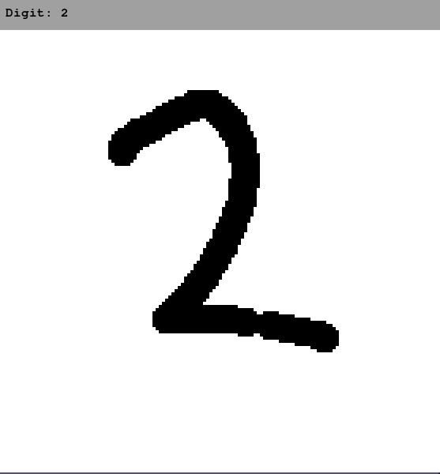

# neural-net-classifier

A mathematical description and implementation of a neural net classifier for recognizing hand-drawn digits.



## Getting Started

Clone and install `nnc` from source
```bash
git clone https://github.com/joeyshi12/neural-net-classifier.git
cd neural-net-classifier
pip install -e .
```

Test the accuracy of one of the provided trained models
```bash
nnc view models/example1.model
```

**Controls**
- Clear canvas: c
- Guess digit with model: \<space\>


Train your own neural net model using the provided mnist data set
```bash
nnc train data/mnist.pkl.gz myclassifier.model
```

View other options with `nnc -h`
